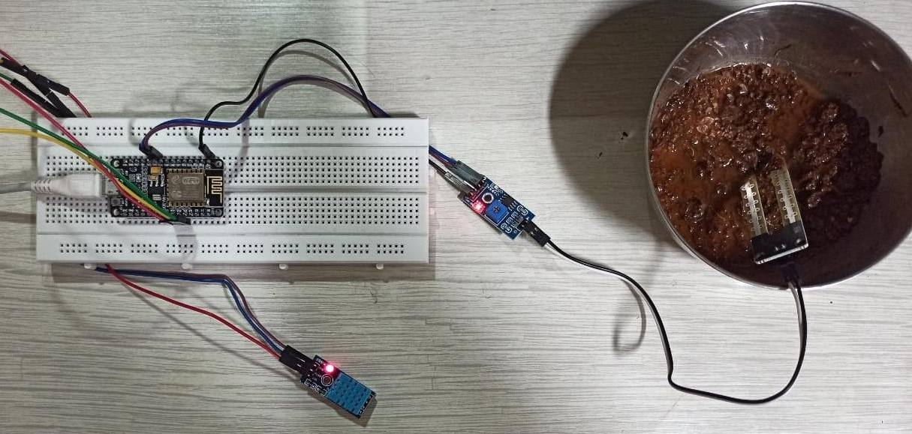
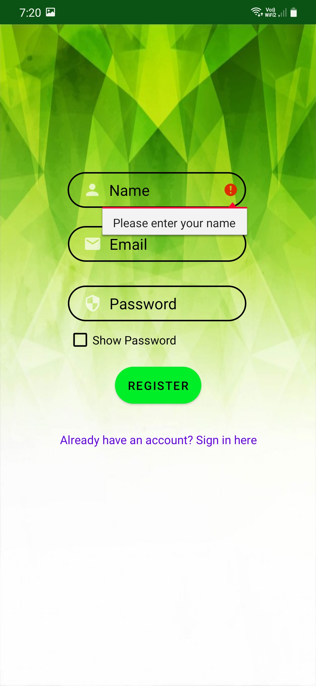
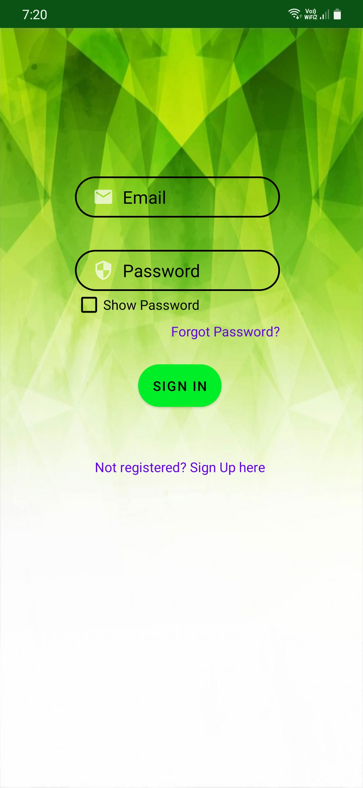
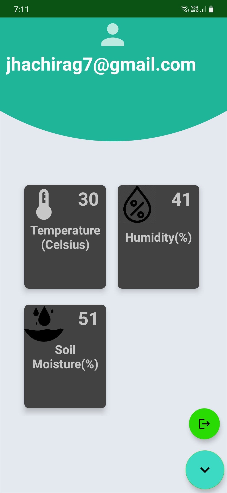

# Smart-Agriculture-system

### note: Arduino and images are sperate folders that is not connected to the Android App

1) Flash the arduino program to the esp8266 module(nodeMCU) to get the Data from the ground at real time and transfer the data to firebase (before doing that various libraries to be imported)
2) Fribase is Medium to connect the Hardware and software, and as well as database   i.e set and get data.

### Ciruit:

### Register Screen:

1) Register program is written in MainActivity.java and gui part activity_main.xml.
2) Once the User **click on the Register button email verfiction will be send**,Once the email is verified then only user will able to access the App.
3) Hyperlink to traverse between Login And Register.

### Login Screen:

1) Login program is written in Login_Activity.java and gui part activity_login.xml.
2) Once the User **click on the SignIn button checks the user in databse and verification of email**.
3) Hyperlink to traverse between Login And Register.

### Home Screen:

1) Home program is written in HomeActivity.java and gui part activity_home.xml.
2) it contains 4 text fields (at top user email, and 3 text to show temperature,humidity and soil moisture), in output email feild is croped due to privacy.
3) And floating logOut button.

